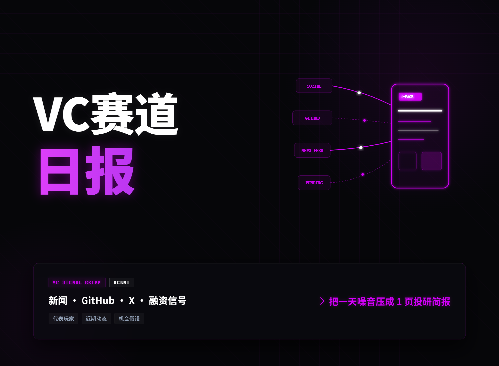

# VC 一页赛道简报 Agent

类型：任务/Agent

Tabbit 链接：[VC 一页赛道简报 Agent](https://web.tabbit.com/share/skill/f9LCTooUMy)

## 一句话卖点

输入行业或技术关键词，自动跨新闻、GitHub、社媒和公开资料调研，输出一页投前赛道简报、机会假设、风险雷达和下一步尽调动作。

## 文件

- [SKILL.md](SKILL.md)：Agent 工作流说明与输出模板。
- [examples/agent-permission-governance-brief.md](examples/agent-permission-governance-brief.md)：企业 AI Agent 权限治理与审计赛道的一页简报输出样例。

## 原创性说明

参考 GPT Researcher、Open Deep Research、n8n Deep Research 这类长报告工作流，但改造成 VC 投前一页简报 Agent。它强调新闻、GitHub、社媒、融资信息的交叉验证，并将输出从“资料汇总”推进到“机会假设、风险雷达、尽调动作”。
